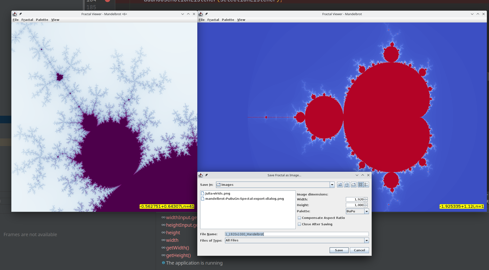
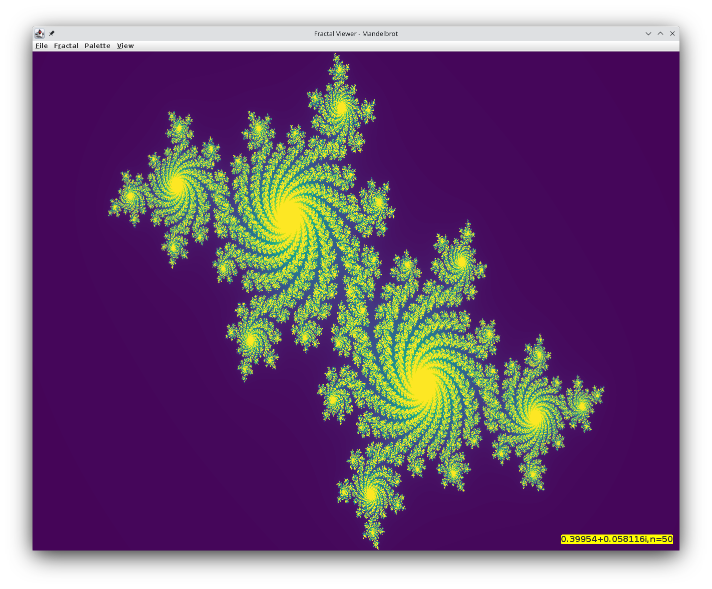

# About

This is a multithreaded fractal viewer written in `Java`. It is *relatively*
fast: depending on the viewed region, rendering a fractal in 800x800 takes
between 100-600ms on 8 threads. Render times on 1 thread are slower.

# Features

- Completely asynchronous, multithreaded architecture; the UI always stays responsive
- Incremental panning and zooming in: the last render is scaled while zooming
  in; while panning, missing regions will be white until filled in by the
  renderer (asynchronously)
- Saving fractals as an image
- Multiple independent windows
- (Continouos) Zooming, Panning
- Many colormaps to choose from, scraped from matplotlib
  + Palette switching is decoupled from fractal computation, and is instant (10-20ms)
- 3 supported fractals; adding more is relatively simple
  1. Mandelbrot
  2. Julia
  3. Sierpinski Triangle (with code adapted from [XaoS](https://github.com/xaos-project/XaoS))
- Aspect ratio compensation: even when the window is non-square, the fractal
  won't be squished/stretched
  
# Inputs and Keybindings

- `MouseWheelForward` -> zoom in, `MouseWheelBackward` -> zoom out
- Panning means shifting the viewport in whatever direction; this corresponds to
  moving the fractal in the opposite direction.

| Keybinding                | Function                                                                                                    |
|:--------------------------|:------------------------------------------------------------------------------------------------------------|
| `Left Click`              | Zoom in at point                                                                                            |
| `Right Click`             | Zoom out at point                                                                                           |
| `Ctrl+MouseWheel`         | Zoom in/out at center continously                                                                           |
| `Alt+MouseWheel`          | Zoom in/out at cursor continouosly                                                                          |
| `Shift+Drag+LMB`[^1]      | Drag out a rectangle and zoom into it; (to draw a non-square, deselect `View->Always Use Square Selection`) |
| `Ctrl+Shift+Drag+LMB`     | Same as above, but always draw a square (stretched to aspect ratio)                                         |
| `(Ctrl)+Shift+Drag+RMB`   | Create a new window with that area zoomed into                                                              |
| `MouseWheelForward`       | Pan upwards                                                                                                 |
| `MouseWheelBackward`      | Pan downwards                                                                                               |
| `Shift+MouseWheelForward` | Pan left                                                                                                    |
| `Shit+MouseWheelBackward` | Pan right                                                                                                   |

[^1]: LMB/RMB refer to the button released at the end of the operation.

# Technologies used

- Java 8
- Swing for GUI
- `maven` for building
- `junit` for some tests
